<p align="center">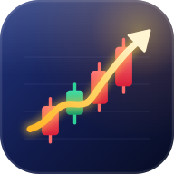</p>

# 股票 · 趋势波段 —— 使用手册

| 项目 | 说明 |
| -- | -- |
| 适用版本 | v0.10.0（2026-10-10），各版本变化见 [更新说明 CHANGELOG.md](CHANGELOG.md) |
| 作者 | 林上升 |
| 联系邮箱 | linshangsheng1987@gmail.com（反馈问题请写上版本号） |
| 版权 | © 2026 林上升 |
| 开源许可 | [MIT](LICENSE)：可以免费使用、修改、分发（包括商用），只需保留版权声明；不提供任何担保 |
| 适用市场 | A 股（主要）、美股 |
| 运行方式 | 本机运行：Python 后端 + 浏览器界面，数据只存在你的电脑上 |
| 适合谁 | 想按**固定规则**做宽基 ETF 择时 + 一篮子低风险股票、并严格控制亏损的个人投资者 |

> **重要声明**
>
> - 本软件是个人研究工具，给出的都是**规则计算结果**，不是投资建议。
> - 所有规则都来自历史数据回测。历史表现不代表未来，单次结果可能与统计倾向完全相反。
> - 软件**不会**替你下单，所有买卖都由你在券商软件里自己完成。

---

## 目录

1. [软件能做什么](#1-软件能做什么)
2. [安装与启动](#2-安装与启动)
3. [第一次使用](#3-第一次使用)
4. [界面总览](#4-界面总览)
5. [每天怎么用（标准流程）](#5-每天怎么用标准流程)
6. [市场温度](#6-市场温度)
7. [宽基指数 / ETF](#7-宽基指数--etf)
8. [个股：观察清单与明天怎么操作](#8-个股观察清单与明天怎么操作)
9. [低风险组合](#9-低风险组合)
10. [资金方案与「每笔最多亏多少」](#10-资金方案与每笔最多亏多少)
11. [持仓：止损、止盈与卖出](#11-持仓止损止盈与卖出)
12. [行情、资讯与自选股](#12-行情资讯与自选股)
13. [回测](#13-回测)
14. [设置](#14-设置)
15. [在手机上使用](#15-在手机上使用)
16. [数据存放、备份与恢复](#16-数据存放备份与恢复)
17. [常见问题](#17-常见问题)
18. [术语表](#18-术语表)

---

## 1. 软件能做什么

| 功能 | 说明 |
| -- | -- |
| **市场温度** | 用「全 A 股站上 20 日均线的比例」判断市场是恐慌还是过热，并给出历史统计 |
| **明天要做什么** | 首页最上方一张卡片：明天宽基 ETF、低风险组合、个股波段、持仓分别要做什么，点一下就跳到具体操作 |
| **宽基 ETF 规则** | 对上证50、沪深300、中证500、中证1000、创业板指给出规则仓位、买入位、离场位、止损位，以及「明天收盘到多少点会触发买卖」；附分年度表现和「策略健康度」 |
| **低风险组合** | 每 20 个交易日（约一个月）调仓一次，等金额持有全市场「最冷门、最平稳」的 10 只股票；不设止损。2018~2026 全市场回测年化约 6%，同期沪深300 约 0.6% |
| **关键均线** | 创业板指、标普500、纳斯达克100 的 20 / 60 / 120 / 200 / 250 日均线：哪条经回测可以操作、明天收盘到多少算站上 / 跌破、该持有还是空仓 |
| **个股观察清单** | 每天收盘后自动选股（默认只用回测为正的「波动收缩突破」形态；默认资金方案里只观察、不分钱） |
| **明天怎么操作** | 对清单里每只股票，按开盘价情景给出买不买、买多少股、碰到止损最多亏多少 |
| **持仓体检** | 每天收盘后检查持仓：止损、止盈、移动止损上移、时间到期 |
| **回测** | 用 10 年历史数据检验规则，区分「样本内（选参数）」和「样本外（检验）」 |
| **自动更新与备份** | 收盘后自动更新数据；个人数据每天备份 |

**它不能做什么**：

- 不能自动下单。
- 不提供 A 股盘中实时行情：所有计算都基于收盘后的日线。
- 美股的参数没有用美股数据单独验证，只作参考。

---

## 2. 安装与启动

### 2.1 环境要求

| 项目 | 要求 |
| -- | -- |
| 操作系统 | Windows 10 / 11（macOS、Linux 可用命令行启动） |
| Python | 3.10 及以上 |
| 浏览器 | Microsoft Edge 或 Chrome |
| 磁盘 | A 股全量数据约 2~3 GB（含备份） |
| 内存 | 建议 8 GB 以上（后端运行时约占 2 GB） |

### 2.2 安装依赖（只需一次）

在软件目录下打开命令行，运行：

```bash
pip install -r server/requirements.txt
```

> **注意**：电脑上装了多个 Python 时，请确认依赖装在命令行里 `python` 指向的那一个上。

### 2.3 启动

**推荐方式**：双击桌面上的「**Stock App**」快捷方式（K 线 + 金色趋势箭头的图标），或软件目录里的 `启动股票.vbs`。

1. 马上弹出**启动画面**：K 线一根根长出来、均线发光、底部进度条写着「启动本地后端 → 连接数据 → 准备就绪」。同时后端在后台启动。
2. 后端准备好后，画面推近淡出，切换到软件（Edge 的「应用窗口」，没有标签栏和地址栏）。后端本来就在运行时，动画约 3 秒；按 `Enter` / 空格可以跳过。
3. **第一次点击页面就进入全屏，按 `Esc` 退出全屏。**
4. 第一次打开时，后台要准备约 40 秒的全市场数据，个别页面会稍慢。


*图 2-1 启动画面：等待后端时播放；90 秒还没启动成功，会显示排查步骤（看 `data\server.log`、用命令行启动看报错、结束残留的 Python）*

> 桌面快捷方式第一次运行时自动创建，之后每次启动都会检查图标是否是新的。图标文件是软件目录里的 `app.ico`，由 `python tools/make_icons.py` 从 `icon.svg` 生成。

**命令行方式**：

```bash
python -m server.main
```

然后在浏览器打开 http://127.0.0.1:8000 。

### 2.4 导航栏底部的三个按钮

| 按钮 | 作用 |
| -- | -- |
| **↻** | 刷新页面。软件更新后点它即可，不需要按 Ctrl+F5 |
| **⛶** | 进入 / 退出全屏 |
| **◐** | 切换深色 / 浅色主题 |

软件更新、后端重启后，页面顶部会出现「**软件已更新 · 点这里刷新**」。

### 2.5 关闭与重启

后端在后台运行，关掉浏览器窗口后它仍在运行，到收盘后会自动更新数据。

**需要彻底关闭或重启时**：

1. 打开任务管理器（`Ctrl + Shift + Esc`）。
2. 找到「Python」，右键「结束任务」。
3. 再双击「Stock App」。

---

## 3. 第一次使用

### 3.1 初始化数据

1. 打开「**设置**」页，点「**初始化数据**」。
2. 选择范围：
   - **全部**：A 股全市场 10 年日线，约 6~9 小时。
   - **随机拉 N 只**：例如 100 只，几分钟，适合先试用。
3. 等待完成。过程中可以随时中断，下次点「补全 / 继续初始化」会接着下载，已下载的不会重复。

命令行也可以：

```bash
python -m server.cli init              # 全部
python -m server.cli init --random 100 # 随机 100 只
```

> **说明**：数据来自 BaoStock（免费、无需注册）。软件对数据源做了限速和熔断，防止你的 IP 被封，所以第一次下载比较慢。之后每天只下载当天的数据，几分钟就好。

### 3.2 录入账户资金

股数要按你的资金计算，所以需要录入一次资金：

1. 在「选股」页清单上方的输入框，或在「持仓」页的「账户参数」里填资金，例如 `100000`。
2. 点「**保存并计算**」。

之后，每只股票都会显示「明天开盘买几股、碰到止损最多亏多少」；指数会显示每个仓位该投多少钱；低风险组合会显示每只买多少股。详见[第 10 章](#10-资金方案与每笔最多亏多少)。

---

## 4. 界面总览

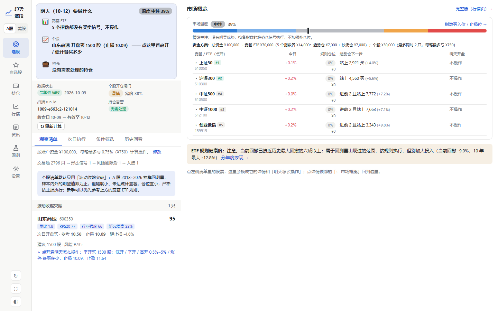

*图 4-1 选股首页（左：「明天要做什么」、状态栏、观察清单；右：市场概览，点开股票后换成详情）*

- **左上「明天要做什么」**：每天最先看这里。宽基 ETF、低风险组合、个股波段、持仓各一行，点击直接跳到要操作的地方。
- **右侧「市场概览」**：市场温度、5 个宽基指数、资金方案、ETF 规则健康度。点开股票后这里换成股票详情；点详情顶部的「← 市场概览」回来。
- 手机上右侧概览会放到左列上方，见[第 15 章](#15-在手机上使用)。

| 导航 | 用途 |
| -- | -- |
| **选股**（首页） | 市场温度、宽基指数摘要、个股观察清单、**低风险组合**、次日执行、条件筛选、历史回看 |
| **自选股** | 自己关注的股票，可批量导入 |
| **持仓** | 持仓体检、交易日志、复盘统计、账户参数 |
| **行情** | 市场温度完整版、宽基指数规则与回测、行业强弱、涨跌排行 |
| **资讯** | 公告、新闻、财报日历 |
| **回测** | 用历史数据检验规则 |
| **设置** | 数据与更新、参数、外观、备份、存储空间 |

左上角的 **A股 / 美股** 可以切换市场。两个市场的数据、参数、持仓完全独立。

---

## 5. 每天怎么用（标准流程）

| 时间 | 你要做的事 | 在哪里 |
| -- | -- | -- |
| **收盘后**（A 股约 17:00 之后） | 什么都不用做：软件自动更新数据、选股、体检持仓、备份 | 自动 |
| **晚上** | 看首页最上方的「**明天要做什么**」；有个股要买时，点开它看「明天怎么操作」 | 选股页 |
| **晚上** | 在券商软件里准备好要买的股票和价位 | 券商 |
| **第二天开盘** | 按开盘价对照「明天怎么操作」表，决定买不买、买多少 | 选股页 → 股票详情 |
| **成交后** | 点「成交了」记录买入；在券商挂好止损单、止盈单 | 次日执行 / 详情 |
| **每天收盘后** | 看持仓体检：要不要上移止损、有没有触发卖出 | 持仓页 |
| **卖出后** | 记录卖出，并选择卖出原因 | 持仓页 |
| **调仓日**（每 20 个交易日，首页 🧺 一行会提前告诉你） | 第二天开盘按「低风险组合」的名单先卖后买，成交后点「成交了 / 卖出了」 | 选股页 → 低风险组合 |

> **提示**：如果电脑在收盘时没开机，下次打开软件会自动补跑缺失的交易日。也可以用 `tools/install_schedule.ps1` 让 Windows 定时唤醒更新。

---

## 6. 市场温度

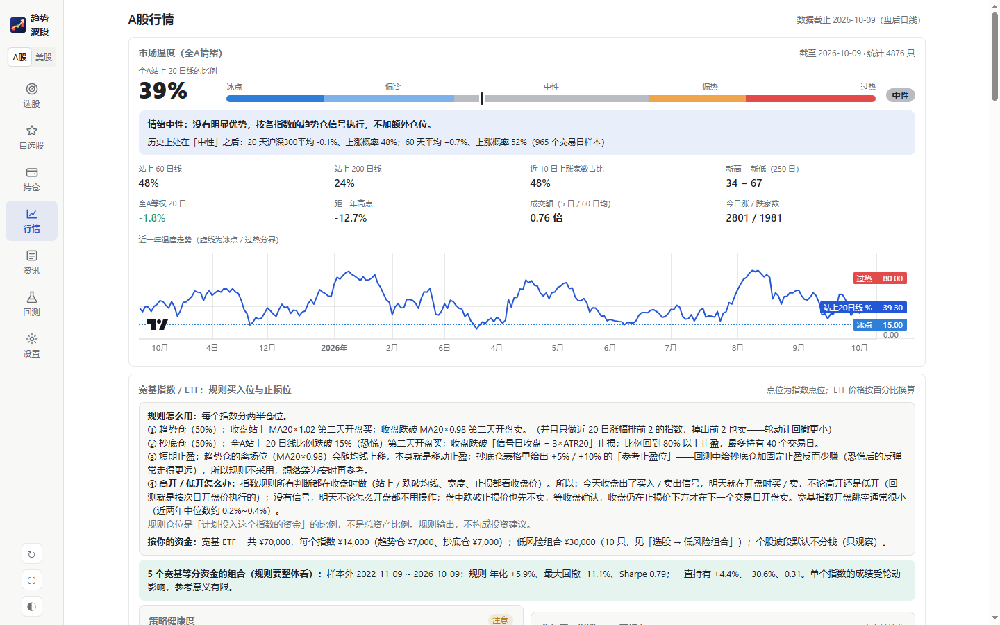

*图 6-1 市场温度：当前比例、所处区间、历史统计、近一年走势（虚线为冰点 / 过热分界）*

### 6.1 它是什么

**市场温度 = 全 A 股里，收盘价站在 20 日均线上方的股票所占的比例。**

| 区间 | 比例 | 含义 |
| -- | -- | -- |
| 冰点 | < 15% | 恐慌、普跌 |
| 偏冷 | 15% ~ 35% | 偏弱 |
| 中性 | 35% ~ 65% | 没有明显倾向 |
| 偏热 | 65% ~ 80% | 赚钱效应明显 |
| 过热 | > 80% | 普涨、情绪过热 |

### 6.2 怎么看

A 股的市场情绪是**逆向**的。2016~2026 年的历史统计：

- **冰点之后**：20 天内沪深300 上涨概率约 60%~70%，五个区间里最高。
- **过热之后**：60 天内上涨概率只有约 33%。

所以：

- **冰点时**：宽基 ETF 的「抄底仓」会触发买入。
- **过热时**：规则会止盈，不追高。

页面上的「历史上处在某区间之后」一行，就是这个统计在当前区间的具体数字。

---

## 7. 宽基指数 / ETF

### 7.1 规则

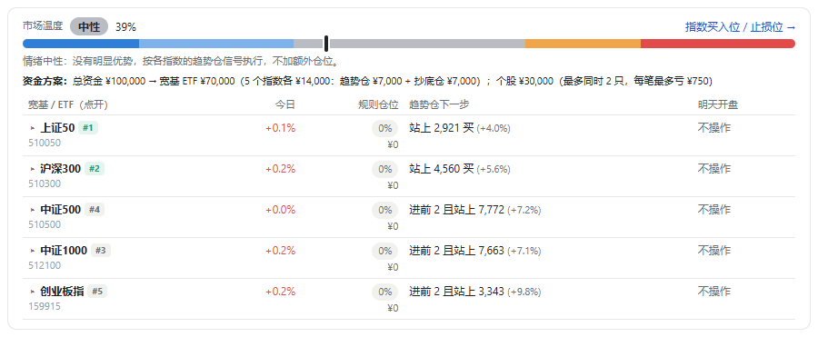

*图 7-1 宽基指数摘要：强弱名次、规则仓位与金额、趋势仓下一步、明天开盘*

每个指数的计划资金分成两半：

| 仓位 | 买入条件 | 卖出条件 |
| -- | -- | -- |
| **趋势仓（50%）** | 收盘站上「20 日均线 × 1.02」，**并且**近 20 日涨幅在 5 个指数里排**前 2 名**，**第二天开盘**买 | 收盘跌破「20 日均线 × 0.98」，或掉出前 2 名，第二天开盘卖 |
| **抄底仓（50%）** | 市场温度收盘跌破 15%（冰点），第二天开盘买 | 收盘跌破止损价（信号日收盘 − 3 倍日均波动），或温度回到 80% 以上，或持有满 40 个交易日 |

**强弱名次**：指数名旁边的 `#1`~`#5` 是近 20 日涨幅排名，绿色表示在前 2 名、可以持有趋势仓。

> **为什么只做最强的 2 个**：按 5 个指数等分资金的组合回测（前 60% 选、后 40% 验）：
>
> | 方案 | 前段 Sharpe / 回撤 | 后段 Sharpe / 回撤 |
> | -- | -- | -- |
> | 5 个都做 | 0.40 / -15.5% | 0.71 / -13.7% |
> | 只做最强 2 个 | 0.57 / -12.8% | 0.79 / -11.0% |
>
> 代价是后段年化从 6.9% 降到 5.9%。同时检验过「按波动率减仓」「按波动率分配资金」，都更差，没有采用。

**对应 ETF**：

| 指数 | ETF 代码 |
| -- | -- |
| 上证50 | 510050 |
| 沪深300 | 510300 / 159919 |
| 中证500 | 510500 |
| 中证1000 | 512100 |
| 创业板指 | 159915 |

表中的点位都是**指数点位**。ETF 价格请按表里的百分比换算，例如「较今收 +4.0%」就是 ETF 现价 × 1.04。

### 7.2 明天会发生什么（点指数名展开）

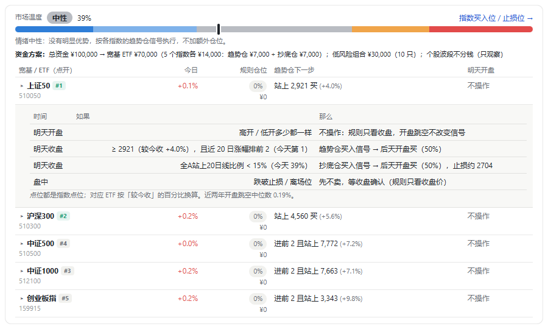

*图 7-2 点选股页指数表里的指数名，展开「明天的情景」*

| 时间 | 如果 | 那么 |
| -- | -- | -- |
| 明天开盘 | 高开 / 低开多少都一样 | 不操作：规则只看收盘价 |
| 明天收盘 | ≥ 某个点位（软件按公式精确算出） | 趋势仓买入信号，后天开盘买 |
| 明天收盘 | 市场温度 < 15% | 抄底仓买入信号，后天开盘买 |
| 盘中 | 跌破止损位 / 离场位 | 先不卖，等收盘确认 |

> **为什么高开低开都不管**：规则的所有判断都基于收盘价，回测也是按「第二天开盘价」执行的。宽基指数开盘跳空通常很小，近两年中位数只有 0.2%~0.4%。

### 7.3 历史回测

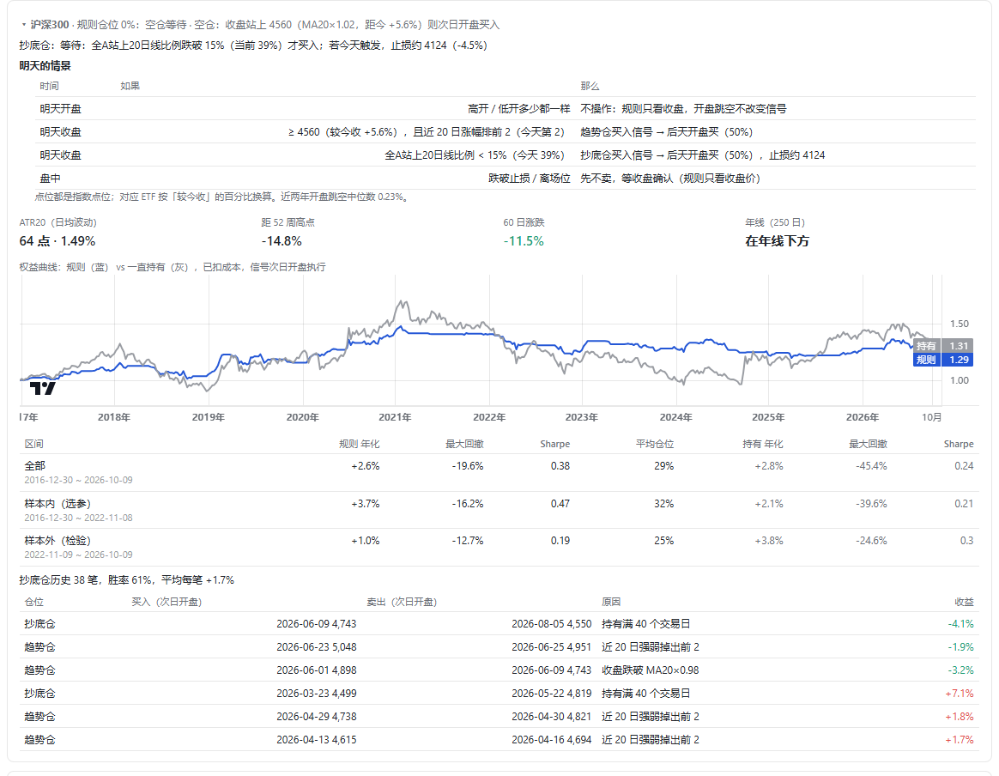

*图 7-3 行情页点开某个指数：明天的情景、权益曲线（规则 vs 一直持有）、样本内 / 样本外成绩、最近交易*

**怎么读**：有了轮动之后，规则要按 **5 个指数的组合**整体看，单个指数的成绩参考意义有限。组合在样本外（2022-11 ~ 2026-10）的表现：

| 方案 | 年化 | 最大回撤 | Sharpe |
| -- | -- | -- | -- |
| 规则 | +5.9% | -11.1% | 0.79 |
| 一直持有 | +4.4% | -30.6% | 0.31 |

### 7.4 分年度表现与策略健康度

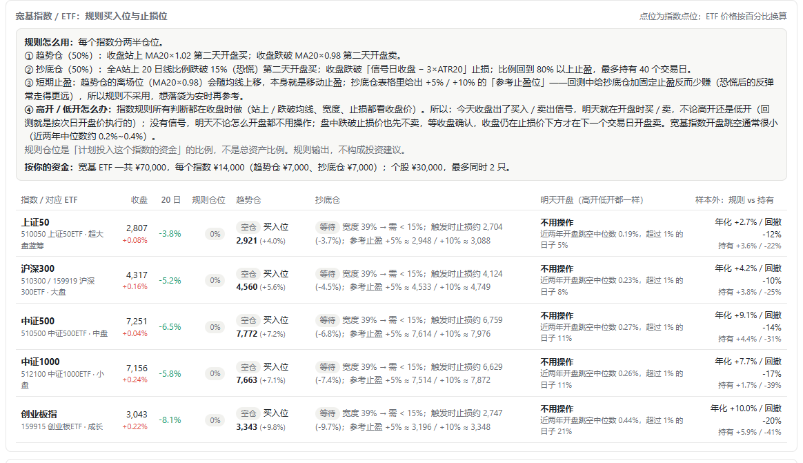

*图 7-4 行情页：组合成绩、策略健康度、分年度「规则 vs 一直持有」*

**分年度**：规则在熊市少亏很多，在牛市明显跑输。这是用收益换平稳，不是失效。

| 年份 | 规则 | 一直持有 |
| -- | -- | -- |
| 2018（熊市） | -7.8% | -28.8% |
| 2022（熊市） | -5.6% | -22.2% |
| 2019（牛市） | +13.8% | +33.1% |
| 2025 | +14.8% | +27.4% |

**策略健康度**：比较规则当前的回撤和 10 年回测里最大的回撤（-12.8%）。

| 状态 | 含义 | 怎么做 |
| -- | -- | -- |
| 正常 | 回撤在历史正常范围内 | 按规则执行 |
| 注意 | 当前回撤超过历史最大的六成 | 按规则执行，但别加大投入 |
| 警告 | 当前回撤达到或超过历史最大 | 出现了回测里没见过的情况：暂停新开仓，复查规则（首页会显示提醒） |

**参数是否稳健**：每次只改一个参数做检验（均线 15~30 日、带宽 1%~3%、前 1~3 名、抄底阈值 12%~18% 等），样本外 Sharpe 都在 0.68~0.92 之间（一直持有 0.31）。结果是稳定的「平台」，不是碰巧的尖峰，所以不再微调。

**短期止盈**：

- 趋势仓的离场位会随均线上移，本身就是移动止盈。
- 抄底仓的表格里给出 +5% / +10% 的「参考止盈位」。回测显示给抄底仓加固定止盈反而少赚，所以规则不采用，想落袋为安时可以参考。

### 7.5 关键均线（创业板指 / 标普500 / 纳斯达克100）

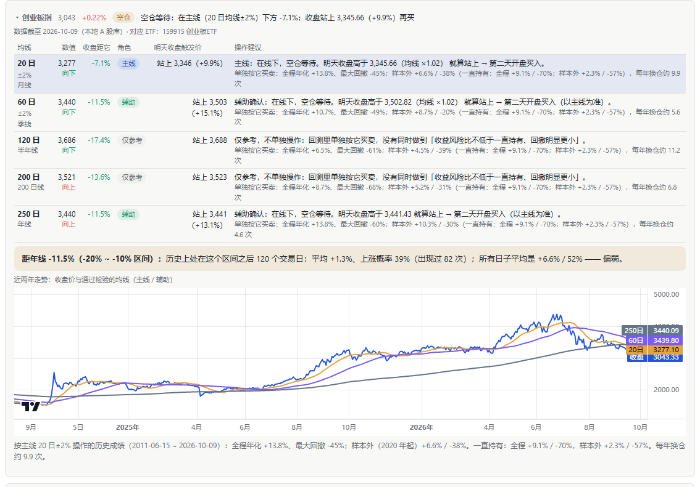

*图 7-5 行情页「关键均线」：点开指数，看每条均线的位置、明天收盘到多少算站上 / 跌破、操作建议和近两年走势*

**均线是什么**：最近 N 个交易日收盘价的平均。常用的 5 条：20 日（月线）、60 日（季线）、120 日（半年线）、200 日、250 日（年线）。

**哪些均线可以拿来操作**：每条均线都单独回测过——收盘站上就持有、跌破就空仓。只有在「前 60% 的历史」和「后 40% 的历史」里**都**做到「收益风险比不低于一直持有，并且最大回撤浅 10 个百分点以上」，才算可以操作。结果：

| 指数 | 20 日 | 60 日 | 120 日 | 200 日 | 250 日（年线） | 一直持有（年化 / 最大回撤） |
| -- | -- | -- | -- | -- | -- | -- |
| 创业板指（2011~） | **主线**（±2%） | 辅助 | 仅参考 | 仅参考 | 辅助 | +9.1% / -70% |
| 标普500（1951~） | 仅参考 | 仅参考 | 仅参考 | **主线** | 辅助 | +10.8% / -55% |
| 纳斯达克100（1986~） | 仅参考 | 仅参考 | 仅参考 | **主线** | 仅参考 | +15.2% / -83% |

- **主线**：照它操作。面板会写「在线上，持有；收盘跌破 X 就卖」或「在线下，空仓；收盘站上 X 再买」。
- **辅助**：也通过了检验，用来确认；以主线为准。
- **仅参考**：单独按它买卖，回测里没有更好，只看不操作。

**三个指数的主线**：

| 指数 | 主线 | 按主线操作（全程年化 / 回撤） | 样本外 | 每年换仓 |
| -- | -- | -- | -- | -- |
| 创业板指 | 20 日均线 ±2%（就是 ETF 规则的趋势仓） | +13.8% / -45% | +6.6% / -38% | 9.9 次 |
| 标普500 | 200 日均线 | +10.4% / -22% | +7.9% / -22% | 5.9 次 |
| 纳斯达克100 | 200 日均线 | +12.8% / -59% | +15.0% / -22% | 6.8 次 |

按均线操作的代价是牺牲一部分收益、换回撤：标普500 年化和一直持有差不多（10.4% 对 10.8%），最大回撤从 -55% 降到 -22%；纳斯达克100 年化低一些（12.8% 对 15.2%），最大回撤从 -83% 降到 -59%；创业板指年化反而更高（13.8% 对 9.1%）。

美股的短均线（20 / 60 / 120 日）都没通过：在美股里频繁按短均线进出，样本外明显变差。创业板正好相反，短均线最好用。

**距年线多远**：面板还会显示「距年线 +x%」以及历史上处在这个区间之后 120 个交易日的平均涨跌和上涨概率：

- **标普500** 跌到年线 20% 以下，历史上之后多数反弹（平均 +14.9%，上涨概率 85%，27 次）——面板会提示「超跌区，可以用小钱分批抄底」，但主线仓位照规则走。
- **纳斯达克100** 跌到年线 20% 以下，历史上没有反弹优势（平均 +1.5%，上涨概率 50%，像 2000~2002 年一路跌）——不抄底，等站上主线。
- **创业板指** 刚跌破年线（0 ~ -10%）是历史上最差的区间（平均 -3.0%，上涨概率 25%）。

**为什么不给「加杠杆」建议**：杠杆版本的历史回撤是 -70% ~ -95%（纳指 3 倍从 2000 年开始会亏光），对参数也很敏感；A 股账户也买不到杠杆 ETF。

**美股指数怎么买**：在 A 股账户买 QDII ETF——标普500 是 513500，纳斯达克100 是 513100 / 159941。美股收盘在北京时间早上：看到跌破 / 站上，当天在 A 股买卖。QDII 常有溢价（额度紧张时可达 10% 以上），买前先看盘中参考净值（IOPV），溢价明显时别追。美股指数数据从 yfinance 获取，每 3 小时更新一次；拉取失败时用上次的数据，并标「可能不是最新」。

复现：`python tools/ma_research.py`（结果写入 `server/key_ma_evidence.json`）。

---

## 8. 个股：观察清单与明天怎么操作

### 8.1 观察清单

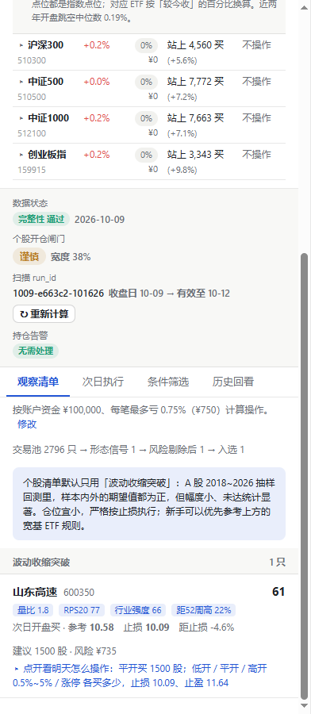

*图 8-1 观察清单：每只股票的参考价、止损、建议股数，以及「点开看明天怎么操作」*

每天收盘后，软件从约 2800 只「交易池」股票里选出符合「**波动收缩突破**」形态的股票，按综合分排序。

- **参考价**：信号日的收盘价，只用来算止损距离和股数。
- **止损**：跌到这里就卖。
- **距止损**：参考价到止损价的距离。
- **综合分**：同时有多只股票时按它排先后。综合分 = **低换手 + 低波动**：越冷门、越平稳，分越高。
- **个股开仓闸门**（状态栏）：
  - 「谨慎」：仓位减半；
  - 「防守」：不开新仓。

> **为什么按「低换手 + 低波动」排序**：
>
> - A 股横截面检验（约 1000 只 × 6 年，样本内外一致）里，换手率、波动率越高的股票之后平均越弱，近期涨得多（RPS 高）的也更弱。原来按 RPS 排序方向是反的。
> - 放到完整策略里看，由于同时出现的候选很少，排序只影响少数交易，前后两段结论不一致，效果很小。
> - 想恢复旧排序：配置 `funnel.score_method: momentum`。
> - 「条件筛选」页同样默认按「低换手 + 低波动」排序，不再默认要求 RPS20 ≥ 80。

> **为什么只有「波动收缩突破」**：在 A 股回测中，「突破」和「回踩」都比同一天随便买还差（追涨在 A 股是负优势）。只有「波动收缩突破」在样本内外都为正，但幅度小、统计上不显著。所以默认资金方案不给个股波段分钱（清单只供观察 / 练手），钱放在统计上更可靠的[低风险组合](#9-低风险组合)，见[第 10 章](#10-资金方案与每笔最多亏多少)。

### 8.2 明天怎么操作（点开股票后显示）

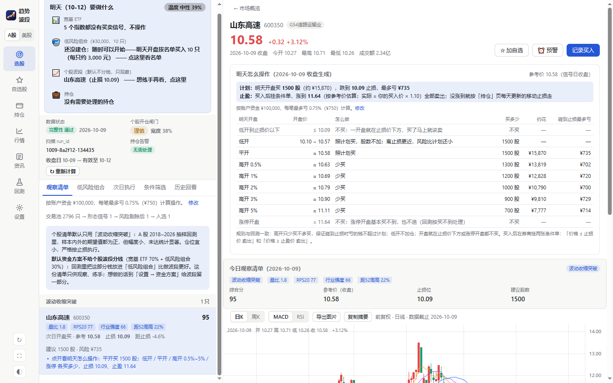

*图 8-2 点开股票：右侧最上方是「明天怎么操作」，下面是清单信息、K 线（含参考价 / 止损线）、指标*

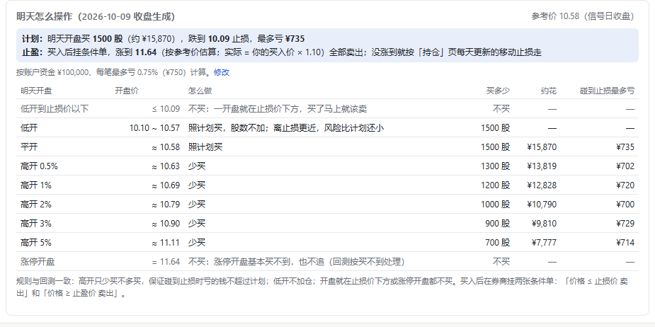

*图 8-3「明天怎么操作」表（示例：山东高速，资金 10 万，每笔最多亏 750 元）*

**第二天开盘时，看开盘价落在哪一行，照做即可**：

| 明天开盘 | 怎么做 | 原因 |
| -- | -- | -- |
| 低开到止损价以下 | **不买** | 一买就该止损 |
| 低开（止损价 ~ 参考价） | **照计划买，股数不加** | 离止损更近，风险比计划还小 |
| 平开 | **照计划买** | — |
| 高开 0.5% / 1% / 2% / 3% / 5% | **少买**（表中给出具体股数） | 保证碰到止损时亏的钱不超过计划 |
| 涨停开盘 | **不买** | 基本买不到，也不追 |

**高开时的股数公式**：

> 股数 = 每笔最多亏 ÷（开盘价 − 止损价），按 100 股向下取整，只少不多

**买入后，在券商挂两张条件单**：

| 条件单 | 作用 |
| -- | -- |
| 价格 ≤ 止损价，卖出 | 止损 |
| 价格 ≥ 你的买入价 × 1.10，卖出 | 短期止盈（+10%） |

两张都没触发时，按「持仓」页每天更新的**移动止损**走。

### 8.3 次日执行

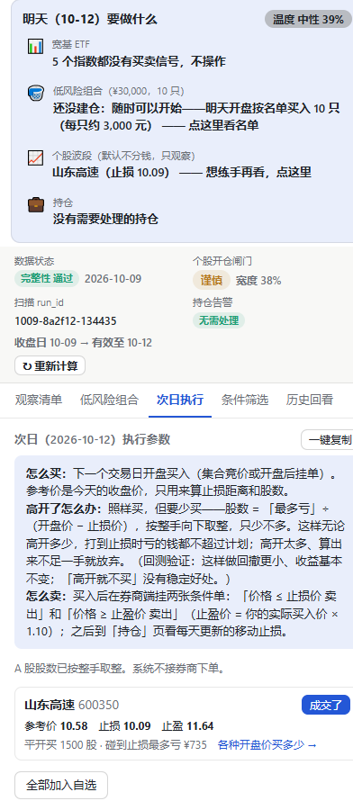

*图 8-4 次日执行：怎么买、高开怎么办、怎么卖，以及每只股票的参考价 / 止损 / 止盈 / 股数*

- **「一键复制」**：把参数复制出来，方便在券商软件里设置。
- **「各种开盘价买多少 →」**：直接跳到图 8-3 那张表。

### 8.4 成交后记录

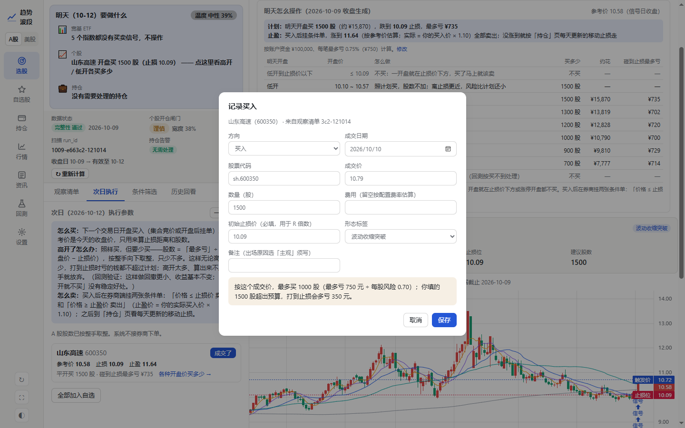

*图 8-5 点「成交了」：填实际成交价和股数，表单会提示按这个价格最多该买几股；超出预算会提醒多亏多少*

1. 在券商成交后，点该股票的「**成交了**」。
2. 填**实际成交价**和**数量**。**初始止损价必须填**，用于计算 R 倍数。
3. 如果数量超出预算，表单会提示「最多买 X 股」以及「打到止损会多亏多少」。
4. 点「保存」。持仓页从第二天起会自动体检。

### 8.5 历史回看（选股器的实盘成绩单）

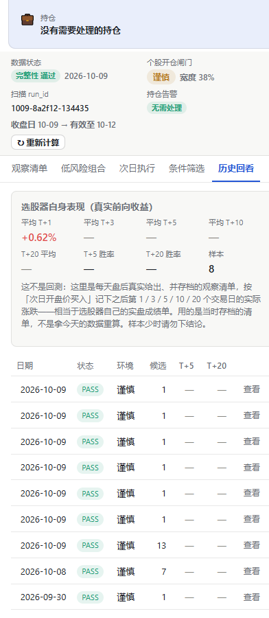

*图 8-6 历史回看：每天真实给出的清单，之后 1 / 3 / 5 / 10 / 20 天的实际涨跌*

这里**不是回测**。它记录的是软件每天真实给出、并存档的清单，按「次日开盘价买入」统计之后的实际涨跌，是最可信的证据。样本少的时候（几十笔以内）不要急着下结论。

---

## 9. 低风险组合

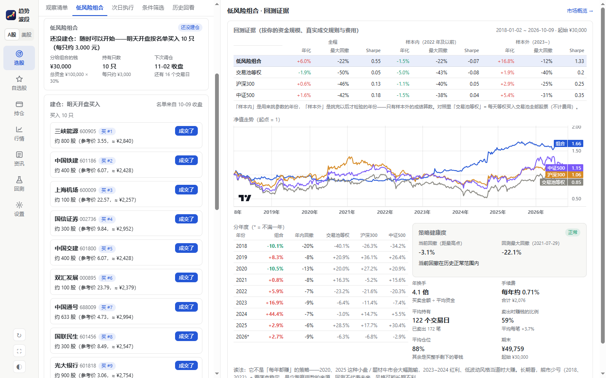

*图 9-1 选股页「低风险组合」标签：左侧是明天的操作和目标名单，右侧是回测证据（手机上回测证据在名单下面）*

### 9.1 它是什么

一句话：**每个月（每 20 个交易日）调整一次，等金额持有全市场里「最冷门、最平稳」的 10 只股票**。不看 K 线形态，不设止损止盈，平时不用管。

- **冷门** = 过去 20 天平均换手率低（买卖的人少、没人炒）。
- **平稳** = 每天平均波动（ATR%）小。
- 两个排名取平均就是「综合分」，选交易池里综合分最高的 10 只。

**为什么这样选**：A 股里检验最稳定的规律之一是「低风险异象」——热门、大起大落的股票之后平均更弱，冷门、平稳的股票之后平均更强。软件对约 1000 只股票 6 年做了横截面检验（样本内外结论一致），又用全市场 5133 只股票（含已退市）做了 2018~2026 的完整组合回测，整手、最低 5 元佣金、印花税、涨跌停买卖不了都算进去了。

### 9.2 回测成绩

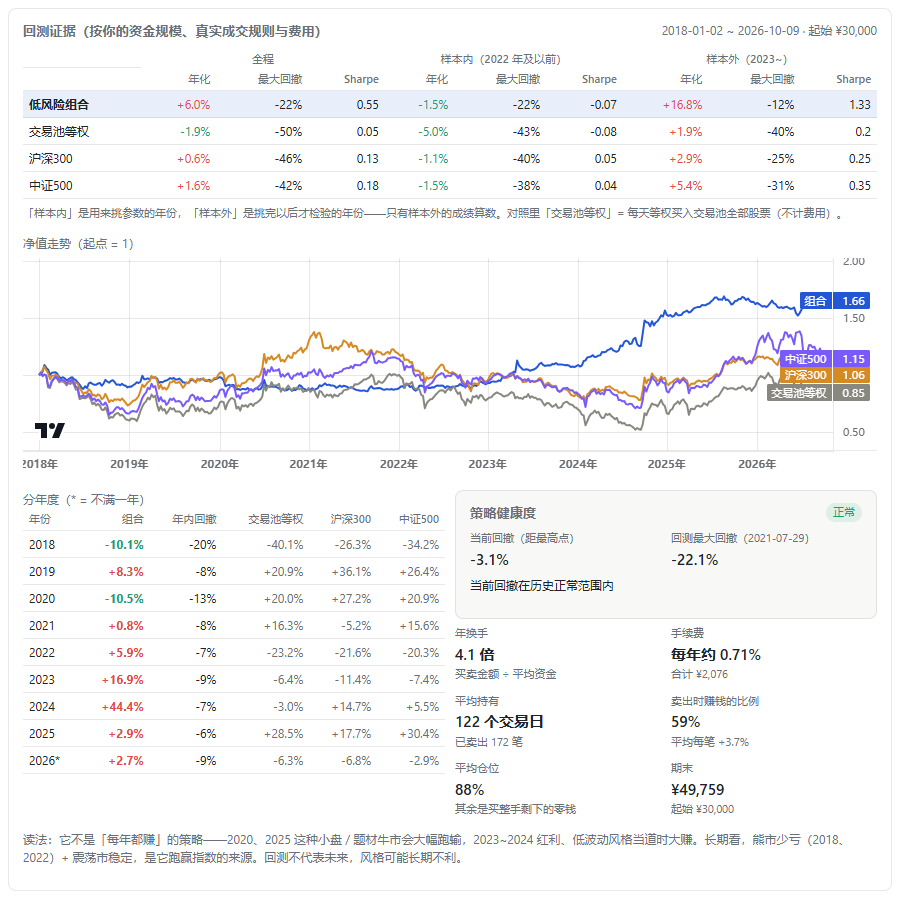

*图 9-2 回测证据：按你分给组合的资金（这里是 3 万）回测，和交易池等权、沪深300、中证500 对比*

3 万资金、2018-01 ~ 2026-10：

| | 全程年化 | 最大回撤 | 样本内年化（2018~2022） | 样本外年化（2023~） |
| -- | -- | -- | -- | -- |
| **低风险组合** | **+6.0%** | **-22%** | **-1.5%** | **+16.8%** |
| 交易池全部股票等权 | -1.9% | -50% | -5.0% | +1.9% |
| 沪深300 | +0.6% | -46% | -1.1% | +2.9% |
| 中证500 | +1.6% | -42% | -1.5% | +5.4% |

分年度：

| 年份 | 组合 | 沪深300 | 交易池等权 |
| -- | -- | -- | -- |
| 2018 | -10.1% | -26.3% | -40.1% |
| 2019 | +8.3% | +36.1% | +20.9% |
| 2020 | -10.5% | +27.2% | +20.0% |
| 2021 | +0.8% | -5.2% | +16.3% |
| 2022 | +5.9% | -21.6% | -23.2% |
| 2023 | +16.9% | -11.4% | -6.4% |
| 2024 | +44.4% | +14.7% | -3.0% |
| 2025 | +2.9% | +17.7% | +28.5% |
| 2026（到 10 月） | +2.7% | -6.8% | -6.3% |

**怎么验证的**（防止「挑出来的好看结果」）：

- 回测前先写好 8 个方案（综合分 2 种 × 持有 10 / 20 只 × 每 10 / 20 天调仓），只用 2018~2022 挑，2023 年以后只做检验。
- 「再加上近期跌得多（短期反转）」的方案：换手高 5 倍以上、样本内更差，**否决**。
- 打分推迟一天，结果几乎不变 → 没有偷看未来数据。
- 用随机打分代替综合分，结果 ≈ 全部股票等权 → 回测引擎本身没有偏差。
- 按你真实的资金量（3~5 万）重新比较：10 只和 20 只、每 10 天和每 20 天差别不大，选了手续费最低、最好操作的 **10 只、每 20 个交易日**。

### 9.3 怎么用

**第一次（建仓）**：随时可以开始。

1. 打开「选股 → 低风险组合」，看「建仓：明天开盘买入」。每只大约买「分给组合的钱 ÷ 10」（10 万资金就是每只约 3000 元），股数已按整手算好。
2. 第二天开盘按市价买入（集合竞价挂单，或开盘后马上挂单）。
3. 成交后点每只后面的「**成交了**」，填实际成交价和股数。类型会自动标成「低风险组合」，**不用填止损价**。

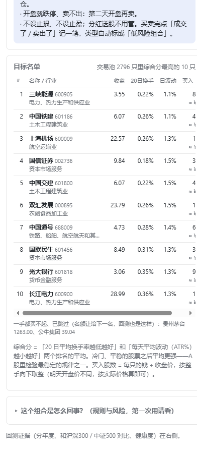

*图 9-3 目标名单：排名、行业、收盘价、20 日换手率、日波动，以及按你的资金估算的股数*

**平时**：什么都不用做。不设止损止盈，也不用每天看。首页 🧺 那一行会写「持有 10 只，不用操作，下次调仓：X 月 X 日收盘后出名单」。

**调仓日**（每 20 个交易日一次，所有人同一套日期）：

1. 调仓日收盘后，首页 🧺 一行变成「明天开盘调仓：卖出 a 只、买入 b 只」。
2. 第二天开盘**先卖后买**。卖出的点「卖出了」（卖出原因自动选「调仓」），买入的点「成交了」。
3. 已经持有的，只要排名还在前 20 名就**继续拿着**，不为一两名的变化来回换。所以每次一般只换两三只。

**特殊情况**（回测里都是这样处理的）：

| 情况 | 怎么做 |
| -- | -- |
| 开盘就涨停，买不进 | 这只本期放弃，不追，等下次调仓 |
| 开盘就跌停，卖不出 | 第二天开盘再卖 |
| 停牌 | 复牌后再按名单处理 |
| 一手都买不起（如 3000 元买不了一手茅台） | 软件已经跳过，名额让给下一名 |
| 分红、送股 | 不用管，收益已经算在里面 |
| 开盘价和参考价不一样 | 按实际价格买，金额差不多就行，不用精确 |

### 9.4 要接受的代价

- **它会跟着市场一起亏**：回测最大回撤约 -22%。而且最大回撤不是出现在股灾里，而是 2020~2021 年热门股大牛市时——冷门股阴跌了一年多。
- **牛市、小盘股和题材股大涨的年份会明显跑输**：2020 年跑输沪深300 三十多个百分点，2025 年十几个百分点。可能连续一两年不如指数。
- **它的好处在长期**：熊市少亏（2018、2022）、震荡市稳定赚（2023~2024 红利、低波动风格当道时大赚）。
- **策略健康度**：和 ETF 规则一样，当前回撤接近或超过回测最大回撤时会提示「注意 / 警告」（见右侧回测证据）。
- 只在 A 股验证过，美股不提供。回测不代表未来，风格可能长期不利。

### 9.5 和其他部分的关系

- **资金**：默认分 30%（10 万 = 3 万），见[第 10 章](#10-资金方案与每笔最多亏多少)；可在「设置 → 资金方案」改。
- **持仓页**：组合的持仓标「组合」，波段的标「波段」。组合持仓只估值，不做止损 / 止盈 / 时间退出提醒，不占个股波段的风险额度和空位，也不受「个股开仓闸门」影响。
- **回测页**：「低风险组合」可以改只数、调仓间隔、起始资金等自己回测（见[第 13 章](#13-回测)）。

---

## 10. 资金方案与「每笔最多亏多少」

### 10.1 「每笔最多亏多少」是什么意思

碰到止损就卖，这一点不变。「每笔最多亏多少」决定的是**买多少股**：

- **止损价**决定**在哪里卖**。
- **最多亏多少**决定**买多少股**：

> 碰到止损时亏的钱 = 股数 ×（买入价 − 止损价）

**例子**：买入价 10.58，止损价 10.09，每股亏 0.49 元。

| 买多少 | 碰到止损亏 | 占 10 万 |
| -- | -- | -- |
| 1500 股 | 735 元 | 0.75% |
| 9400 股（几乎全仓） | 4,606 元 | 4.6% |

先定好「这一笔就算止损，最多只亏 750 元」，再反推股数：750 ÷ 0.49 ≈ 1500 股。这样即使连续止损 10 次，也只亏约 7.5%，还有本钱继续。

### 10.2 默认资金方案（以 10 万为例）

| 部分 | 金额 | 规则 |
| -- | -- | -- |
| **宽基 ETF** | 7 万 | 5 个指数各 1.4 万：趋势仓 7000 + 抄底仓 7000（见[第 7 章](#7-宽基指数--etf)） |
| **低风险组合** | 3 万 | 10 只，每只约 3000 元，每 20 个交易日调仓（见[第 9 章](#9-低风险组合)） |
| **个股波段** | 0（只观察） | 观察清单照常每天出，想练手可以在「设置 → 资金方案」给它留一部分；每笔最多亏 0.75% |

**依据**：10 万资金、2018~2026 年回测，整手、最低佣金 5 元都计入。样本内 = 2018~2022，样本外 = 2023 以后。

| 方案 | 全程年化 | 最大回撤 | 收益 / 风险比（Sharpe） | 样本内年化 | 样本外年化 |
| -- | -- | -- | -- | -- | -- |
| **ETF 7 万 + 低风险组合 3 万（默认）** | **5.1%** | **-12.5%** | **0.70** | 2.2% | 9.0% |
| ETF 7 万 + 个股波段 2 只（v0.6 的方案） | 4.0% | -11.0% | 0.63 | 3.7% | 4.5% |
| ETF 6 万 + 组合 3 万 + 波段 1 只 | 4.3% | -11.5% | 0.61 | 1.2% | 8.5% |
| ETF 5 万 + 组合 5 万 | 5.6% | -14.1% | 0.69 | 1.3% | 11.6% |
| 全部低风险组合 | 6.6% | -22.9% | 0.57 | -1.3% | 18.0% |
| 全部 ETF 规则 | 4.5% | -12.8% | 0.60 | 3.7% | 5.7% |

- **为什么是 7 : 3**：ETF 占 30%~70% 之间，全程 Sharpe 几乎一样（0.67~0.70），7 : 3 回撤最小。想多赚、能忍更大回撤，可以多给组合。
- **为什么不给个股波段分钱**：把波段加进来（1 只或 2 只），全程和样本外都没有变好。v0.6 的方案在 2018~2022 年确实更好（3.7% 对 2.2%），但 2023 年以后差很多（4.5% 对 9.0%），而且「波动收缩突破」本身统计上不显著，低风险组合的规律在样本内外都显著。
- **为什么搭配**：ETF 规则和低风险组合的日收益相关性只有 0.35，搭配比单做任何一个都稳。
- **预期**：这是一套控制亏损的方案，长期年化预期只有几个百分点到十个百分点，不是赚快钱的方法。

**修改**：总资金在「持仓」页的「账户参数」里改；ETF / 组合 / 波段的比例和组合只数在「设置 → 资金方案」里改（见[第 14 章](#14-设置)）。组合资金 20 万以上时，可以把只数改成 20，分散更好。

---

## 11. 持仓：止损、止盈与卖出

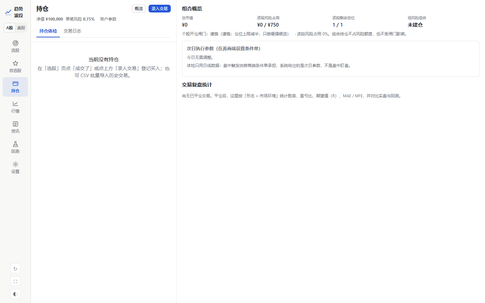

*图 11-1 持仓页：左侧持仓体检 / 交易日志，右侧组合概览（总市值、波段风险占用与空位、低风险组合市值）*

每只持仓前面有类型标签：**组合**（低风险组合，不设止损止盈，调仓日按名单处理）和 **波段**（个股波段，按下面的止损 / 止盈规则）。本章的体检和卖出规则只针对「波段」持仓。

### 11.1 持仓体检（每天收盘后自动）

体检结果分三级：

| 级别 | 含义 | 例子 |
| -- | -- | -- |
| **必须处理** | 第二天要操作 | 触及止损、触及止盈、收盘跌破 20 日均线、持有到期、止损位该上移 |
| **关注** | 留意 | 接近止损、接近止盈、5 个交易日内有财报 |
| **正常** | 不用动 | — |

每只持仓都写明了「下一步做什么」，例如「在券商端把条件单止损价改为 X」。

### 11.2 卖出规则（与回测一致）

| 规则 | 说明 |
| -- | -- |
| 止损 | 盘中跌到止损价就卖（条件单）；开盘就低于止损价，则按开盘价卖 |
| 止盈 | 盘中涨到「买入价 × 1.10」就全部卖出（条件单） |
| 移动止损 | 赚钱后，止损跟着「持有以来最高收盘价 − 3 倍日均波动」上移，只升不降 |
| 收盘跌破 20 日均线 | 第二天开盘卖 |
| 时间退出 | 持有满 20 个交易日还没走出来，第二天开盘卖 |

> **A 股限制**：买入当天不能卖（T+1）；跌停时可能卖不出。这两点回测里都考虑了。

### 11.3 记录卖出

在持仓上点「**记录卖出**」，填成交价并选择卖出原因（止损 / 止盈 / 移动止盈 / 时间退出 / 调仓……；组合持仓默认选「调仓」）。选「主观」时必须写备注，方便复盘。

---

## 12. 行情、资讯与自选股


*图 12-1 行情页顶部：市场温度完整版、各项宽度指标、近一年温度走势（虚线为冰点 / 过热分界）*

| 页面 | 内容 |
| -- | -- |
| **行情** | 市场温度完整版、宽基指数规则（见第 7 章）、历史证据、风格强弱、行业涨跌、涨跌幅 / 放量 / 强势排行 |
| **资讯** | 公告、新闻、财报日历，标注可信度（1 官方 / 2 结构化 / 3 媒体）和事件后 1 / 3 / 5 日涨跌 |
| **自选股** | 自己关注的股票；支持批量导入（文本 / CSV / Excel）；可开「盘中刷新」（≥ 60 秒，美股为主） |

---

## 13. 回测

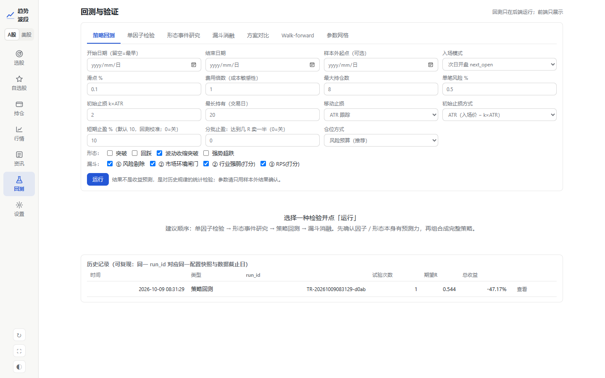

*图 13-1 回测页：选择检验类型、时间段、成交与仓位参数、形态与漏斗开关*

**低风险组合**：选「低风险组合」可以改持有只数、调仓间隔、换手缓冲、起始资金和时间段，直接看和沪深300 / 中证500 / 交易池等权的对比、分年度和健康度。默认参数是按 2018~2022 挑的，改了之后只看样本外。全市场 8 年约 1~2 分钟。

**个股形态的建议顺序**：

1. **单因子检验**：先看指标本身有没有预测力。
2. **形态事件研究**：形态和「同一天随机买入」对比。
3. **策略回测**：完整的成交规则、费用和仓位。
4. **漏斗消融 / 方案对比**：逐项看每个条件有没有用。
5. **Walk-forward**：滚动选参数，只认样本外成绩。

> **重要**：
>
> - 每次回测都会记录「试验次数」。试得越多，越容易碰巧得到好看的结果。
> - **只认样本外的成绩**。样本内明显好于样本外，就是过拟合。
> - 默认参数已经校准过：不熟悉的话，不建议随意修改。
> - 校准脚本：`tools/calibrate.py`（形态 / 出场）、`tools/risk_sizing.py`（每笔风险）、`tools/factor_research.py`（低风险组合的 8 个方案）。

---

## 14. 设置

### 14.1 数据与更新

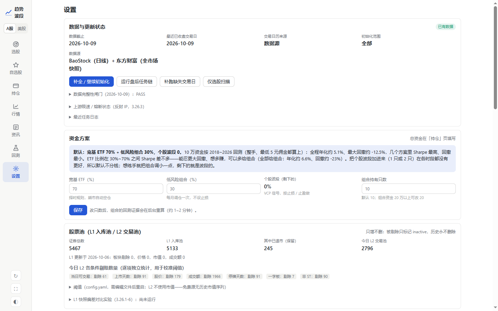

*图 14-1 设置页：数据状态、初始化 / 盘后任务 / 补跑 / 仅扫描按钮、完整性闸门、股票池统计*

| 按钮 | 作用 |
| -- | -- |
| 补全 / 继续初始化 | 继续下载没下完的历史数据 |
| 运行盘后任务链 | 手动执行一次：更新 → 闸门 → 选股 → 体检 → 备份 |
| 补跑缺失交易日 | 电脑多天没开时使用 |
| 仅选股扫描 | 只重新选股（选股页的「↻ 重新计算」也可以） |

### 14.2 资金方案

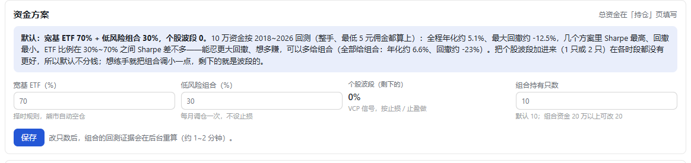

*图 14-2 资金方案：宽基 ETF、低风险组合的比例（剩下的是个股波段）和组合持有只数*

默认 ETF 70%、低风险组合 30%、个股波段 0、组合 10 只。依据见 [10.2](#102-默认资金方案以-10-万为例)。改完点「保存」，回到选股页就按新方案计算；改只数后，组合的回测证据会在后台重算（约 1~2 分钟）。

### 14.3 费用、滑点与组合参数

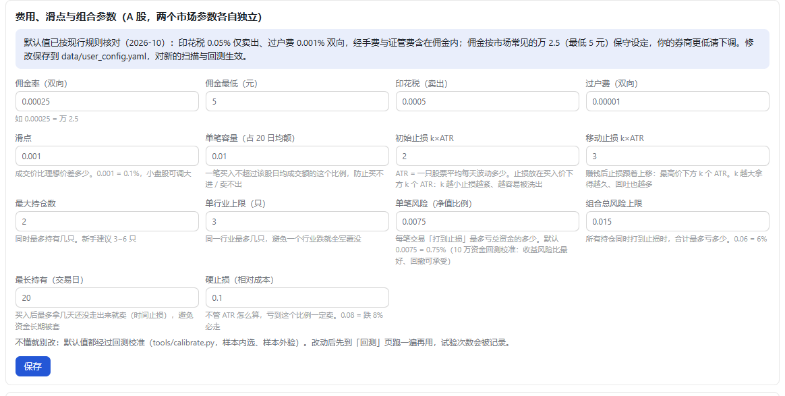

*图 14-3 每个参数下面都有白话说明；改完点「保存」*

**主要默认值**（都经过回测校准）：

| 参数 | 默认值 |
| -- | -- |
| 佣金 | 万 2.5，最低 5 元 |
| 印花税 | 0.05%，仅卖出 |
| 初始止损 | 2 倍 ATR |
| 移动止损 | 3 倍 ATR |
| 最多持有 | 20 个交易日 |
| 硬止损 | 亏 10% 必走 |
| 个股波段最多同时持有 | 2 只（默认资金方案不给波段分钱，只在你做波段时生效） |
| 单笔风险 | 0.75% |

> **提示**：你的券商佣金更低的话，请下调佣金率。修改参数后，建议先到「回测」页跑一遍再用。

### 14.4 外观与访问

- **涨跌配色**：默认 A 股红涨绿跌、美股绿涨红跌，可以改成全局统一。
- **主题**：跟随系统 / 浅色 / 深色。
- **启动后自动全屏**：开 / 关。
- **访问口令**：开放局域网（手机访问）时必须设置，见[第 15 章](#15-在手机上使用)。

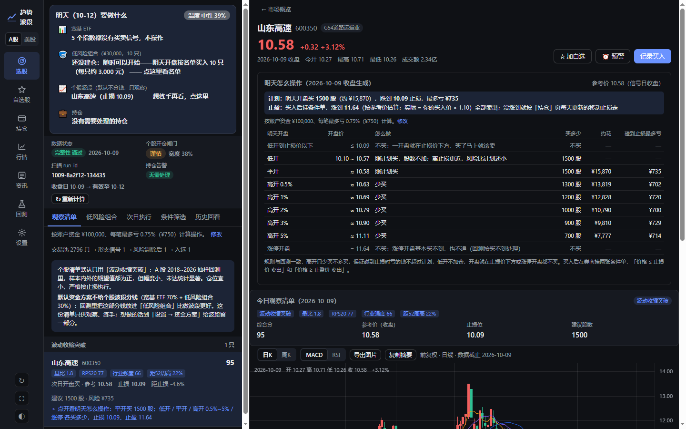

*图 14-4 深色模式（导航栏底部「◐」切换）*

### 14.5 存储空间

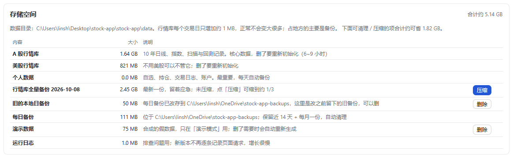

*图 14-5 存储空间：每部分多大、有什么用；可压缩 / 可删除的项有按钮，点之前会再次确认*

- 行情库每个交易日只增加约 1 MB；占地方的主要是备份。
- 「行情库全量备份」可以点「**压缩**」，约缩到原来的 1/3。
- 「演示数据」「旧的本地日备份」可以点「**删除**」。
- 核心数据（行情库、个人数据）不能在这里删除。

### 14.6 关于

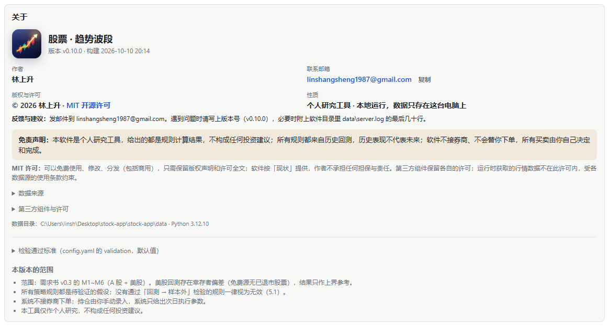

*图 14-6 设置页底部「关于」：版本、作者、联系邮箱、版权、免责声明、数据来源与第三方组件*

- 点导航栏左上角的 **Logo** 也能随时弹出简要的「关于」。
- **反馈问题**：发邮件到 linshangsheng1987@gmail.com，写上版本号；必要时附上软件目录里 `data\server.log` 的最后几十行。
- **数据来源**：BaoStock、东方财富（网页接口）、巨潮资讯、Yahoo Finance（yfinance）、Nasdaq Trader、SEC EDGAR，都是公开 / 免费接口，只用于个人研究。
- **第三方组件**：图表用 TradingView Lightweight Charts™（Apache-2.0，许可文件在 `vendor/` 里）；后端用 FastAPI、pandas、NumPy 等开源库。
- **开源许可**：本软件以 [MIT 许可](LICENSE) 开源。通俗地说：
  - 任何人都可以免费使用、复制、修改、合并、发布、分发，也可以商用；
  - 唯一的条件：在副本里保留版权声明（© 2026 林上升）和许可全文；
  - 软件按「现状」提供，作者不提供任何担保，也不对使用后果负责；
  - 第三方组件保留各自的许可；运行时获取的行情数据不在 MIT 许可内，受各数据源的使用条款约束。
  - 以 `LICENSE` 文件里的英文原文为准。

---

## 15. 在手机上使用

手机不需要另外安装软件，而是**用手机浏览器访问你电脑上运行的这个软件**：数据和计算都在电脑上，手机只是一个屏幕。

**前提**：

- 电脑开着，后端在运行；
- 手机和电脑连的是**同一个 Wi-Fi**。

### 15.1 第一次设置（只做一次）

**① 让电脑允许手机访问**

软件默认只允许电脑自己访问。打开 `data\user_config.yaml`，在末尾加上（口令自己设一个）：

```yaml
server:
  host: 0.0.0.0
  token: "设一个口令，比如 abc123"
```

> **必须设口令**：开放给局域网后，同一个 Wi-Fi 下的任何设备都能连上来，而软件里有你的持仓数据。没设口令时，软件会拒绝启动。

**② 重启后端**

任务管理器结束 Python，再双击「Stock App」。第一次启动时 Windows 防火墙可能会弹窗，选允许「**专用网络**」。

**③ 查电脑的局域网地址**

打开命令行，输入：

```bash
ipconfig
```

找到「IPv4 地址」，例如 `192.168.1.23`。

**④ 手机打开**

在手机浏览器里输入 `http://192.168.1.23:8000`（换成你电脑的地址），按提示填入口令。

**⑤ 放到手机桌面（可选）**

| 手机 | 操作 |
| -- | -- |
| iPhone（Safari） | 分享按钮 →「添加到主屏幕」 |
| 安卓（Chrome） | 右上角菜单 →「添加到主屏幕」 |

### 15.2 手机上怎么操作

| 手机首页 | 点开股票后的「明天怎么操作」 |
| -- | -- |
| 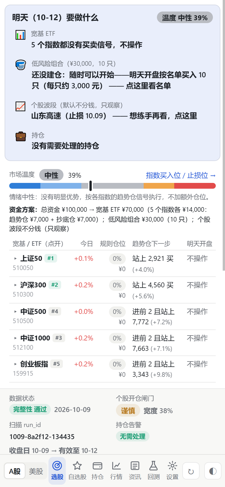 | 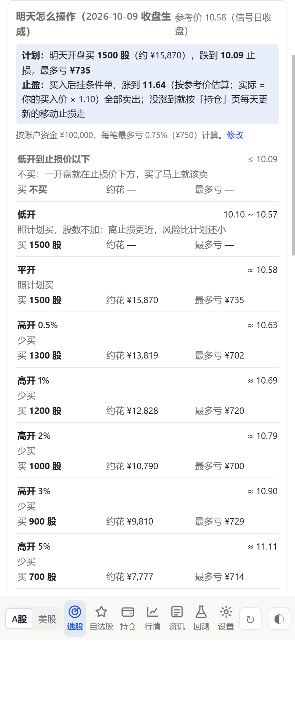 |

*图 15-1 手机界面：导航在底部；「明天怎么操作」自动排成每行一张小卡片*

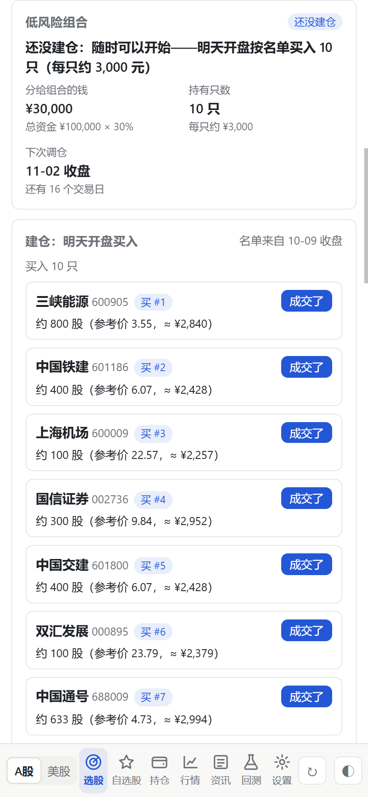

*图 15-2 手机上的「低风险组合」：调仓日历、要买卖的股票和「成交了」按钮；回测证据在名单下面*

- **导航**：在屏幕**底部**，有选股、自选、持仓、行情、资讯、回测、设置。
- **选股页**：最上面是「明天要做什么」，往下是市场温度、指数表和股票清单。
- **看操作**：点一只股票会**全屏**显示详情，最上面就是「明天怎么操作」（低开 / 平开 / 高开各买多少股）。点左上角「**← 返回**」回到清单。
- **记录**：成交后点「成交了」记录买入；卖出在「持仓」页记录。

### 15.3 限制与注意事项

| 情况 | 说明 |
| -- | -- |
| 不能离线 | 用 `http://` 地址时，手机只能在线浏览，不能离线使用，也装不成完整的手机应用（浏览器规定需要 HTTPS）。需要的话：运行 `python tools/make_cert.py` 生成证书，再在手机上信任该证书。步骤较繁琐，一般用不到 |
| 出门用 4G 连不上 | 只有在同一个 Wi-Fi 下才能访问。想在外面用，推荐电脑和手机都装 **Tailscale**（免费），相当于两台设备之间的私人专线。**不要**在路由器上设端口转发、把软件暴露到公网 |
| 电脑睡眠 / 关机 | 手机就连不上了；电脑需要保持开机 |
| 手机打不开页面 | 依次检查：两台设备是否在同一个 Wi-Fi；`user_config.yaml` 改完后是否重启了后端；防火墙是否允许了 Python；地址里的 IP 和端口 `8000` 是否正确 |

---

## 16. 数据存放、备份与恢复

### 16.1 数据存在哪里

所有数据都在软件目录下的 `data/` 里：

| 文件 / 目录 | 内容 |
| -- | -- |
| `ashare.db` / `us.db` | A 股 / 美股行情库 |
| `portfolio.db` | 自选、持仓、交易日志、账户（最重要） |
| `user_config.yaml` | 你在设置页改过的参数 |
| `backups_full/` | 行情库全量备份（压缩，只留最新 1 份） |
| `server.log` | 运行日志 |

> `data/` 不会被提交到 git（见 `.gitignore`）：行情数据太大，持仓和账户属于个人隐私。

### 16.2 备份

| 备份 | 频率 | 内容 | 保留 |
| -- | -- | -- | -- |
| **每日备份** | 每天收盘任务后自动 | 个人数据、选股与回测记录、已退市股票历史、配置 | 近 14 天 + 每月一份 |
| **全量备份** | 每周一次 | 整个行情库（gzip 压缩） | 最新 1 份 |

每日备份的位置在 `data/user_config.yaml` 的 `backup.dir` 里设置。**建议设到网盘同步目录**（例如 OneDrive），防硬盘损坏。

### 16.3 恢复

先关闭后端（任务管理器结束 Python），再运行：

```bash
python -m server.cli restore --date 2026-10-10 --what portfolio   # 恢复个人数据
python -m server.cli restore --date 2026-10-10 --what ashare      # 恢复 A 股行情库（从全量备份）
```

恢复前，软件会自动把现有文件另存为 `.before_restore`。

---

## 17. 常见问题

| 现象 | 原因 / 处理 |
| -- | -- |
| 打开后页面没反应 / 打不开 | 后端没在运行：双击「Stock App」；仍不行时用命令行 `python -m server.main` 看报错 |
| 看不到新功能 | 后端还是旧版本：任务管理器结束 Python，再双击「Stock App」；然后点导航栏底部「↻」 |
| 不显示股数 | 还没录入账户资金：在清单上方或「持仓」页填写（见 3.2） |
| 选股页提示「数据完整性闸门未通过」 | 当天数据缺失或异常：到设置页点「运行盘后任务链」补拉；「仅供参考」的结果不会存档 |
| 今天没有候选股票 | 正常现象：「波动收缩突破」信号本来就少；也可能被「防守」闸门挡住了 |
| 策略健康度显示「注意」或「警告」 | 「注意」：回撤在历史范围内，照常执行，别加大投入；「警告」：超过了 10 年回测的最大回撤，先暂停新开仓（见 7.4） |
| ETF 规则在大涨的年份跑输指数 | 这是规则的特点：它在熊市少亏很多，代价是牛市少赚（见 7.4 分年度表） |
| 为什么不给「跌破均线就加杠杆」的建议 | 杠杆版本历史回撤 -70% ~ -95%，对参数很敏感，A 股账户也买不到杠杆 ETF（见 7.5） |
| 关键均线里美股指数显示「可能不是最新」 | 连不上 yfinance 时用的是上次的数据；网络恢复后 3 小时内自动更新 |
| 低风险组合今年跑输大盘 | 正常：小盘 / 题材 / 热门股大涨的年份它会明显跑输（2020、2025 都是），按日历调仓即可，看「策略健康度」判断是否异常（见 9.4） |
| 组合里有只股票跌了很多，要不要止损 | 不止损：组合赚的是一篮子股票的统计优势，单只的涨跌不重要；排名掉出前 20 名会在调仓日提示卖出 |
| 组合名单里有我买不起的股票 | 软件已按你的资金跳过一手都买不起的股票，名额让给下一名；名单下方会写跳过了哪几只 |
| 中途才开始用组合，要等调仓日吗 | 不用等：随时可以按当前名单建仓，之后按统一的调仓日历走 |
| 东财快照 / 资金数据失败 | 东财有 IP 限流，软件会自动降速和降级；不要反复手动刷新 |
| 第一次打开某页很慢 | 正在构建全市场数据（约 40 秒），之后就快了 |
| 自动全屏没生效 | 浏览器规定必须先点击一次页面才能全屏；按 `Esc` 退出后，本次不再自动全屏，可点「⛶」 |
| 手机打不开页面 | 见 [15.3](#153-限制与注意事项) 的检查顺序 |
| 端口 8000 被占用 | 之前的后端还在运行：结束旧的 Python 进程；或设置环境变量 `PORT=8001` 再启动 |
| 双击 vbs 没反应 / 提示缺模块 | 系统 PATH 上的 python 不是装了依赖的那个：在命令行运行 `python -m server.main` 看报错 |

---

## 18. 术语表

| 术语 | 解释 |
| -- | -- |
| **20 日均线（MA20）** | 最近 20 个交易日收盘价的平均值 |
| **ATR / 日均波动** | 一只股票或指数平均每天波动多少；止损一般放在「买入价 − 2~3 倍 ATR」 |
| **止损 / 止盈** | 跌到某价卖出以限制亏损 / 涨到某价卖出以锁定利润 |
| **移动止损** | 赚钱后止损价跟着上移，只升不降 |
| **R / R 倍数** | 1R = 碰到初始止损时亏的钱；赚 2R 就是赚了两倍风险金额 |
| **每笔最多亏 / 单笔风险** | 一笔交易碰到止损时最多亏总资金的比例，用来决定股数 |
| **市场温度 / 宽度** | 全 A 股站上 20 日均线的股票比例 |
| **趋势仓 / 抄底仓** | 宽基 ETF 规则的两半仓位：前者跟随均线，后者在市场冰点买入 |
| **均线 / 月线 / 季线 / 半年线 / 年线** | 最近 N 个交易日收盘价的平均；20 日叫月线、60 日季线、120 日半年线、250 日年线 |
| **QDII ETF** | 在 A 股账户就能买的境外指数基金（如 513500 标普500、513100 纳指）；有额度限制，常有溢价 |
| **低风险组合** | 每 20 个交易日调仓一次、等金额持有「低换手 + 低波动」综合分最高的 10 只股票的组合 |
| **换手率** | 一天的成交股数占流通股数的比例；20 日平均换手率低 = 冷门、关注的人少 |
| **调仓** | 按新名单卖掉掉出名单的、买入新进名单的，让组合回到目标状态 |
| **波动收缩突破（VCP）** | 股价波动逐渐收窄后，放量突破整理区间 |
| **样本内 / 样本外** | 用来挑参数的那段历史 / 留出来检验的那段历史；只有样本外成绩才算数 |
| **Sharpe（收益 / 风险比）** | 每承担一份波动换来多少收益，越高越好 |
| **最大回撤** | 资金从最高点跌到最低点的最大幅度 |
| **T+1** | A 股买入当天不能卖出 |
| **L1 / L2** | L1 入库池（下载哪些股票）/ L2 交易池（当天可以选哪些股票，剔除了低价、低成交额、停牌、ST 等） |

---

**更多资料**：

- [更新说明（CHANGELOG）](CHANGELOG.md)：每个版本新增、改进、默认值变更与修复。
- [开发说明](docs/开发说明.md)：目录结构、实现范围、回测校准结论、默认假设。
- [M0 数据可行性验证报告](docs/M0-数据可行性验证报告.md)
- [技术需求书](技术需求书-股票App.md)

截图由 `python tools/screenshots.py` 自动生成。界面更新后重新运行即可刷新全部截图。

---

**作者**：林上升 · **联系邮箱**：linshangsheng1987@gmail.com · © 2026 林上升 · [MIT 许可](LICENSE)。本软件是个人研究工具，所有输出均为规则计算结果，不构成投资建议。
